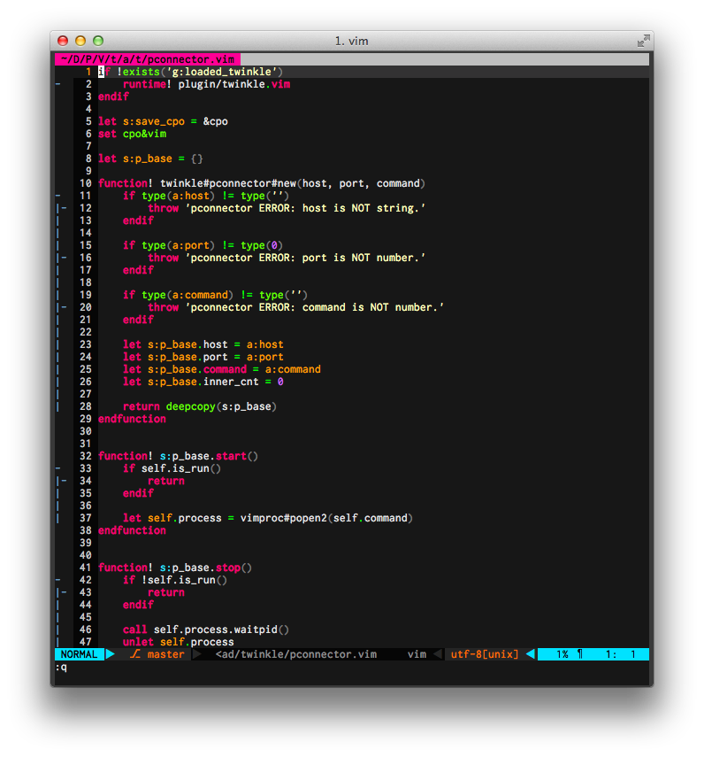
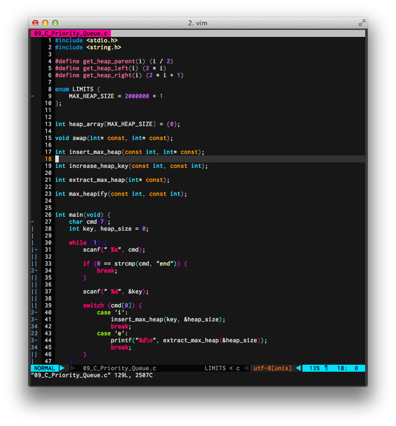
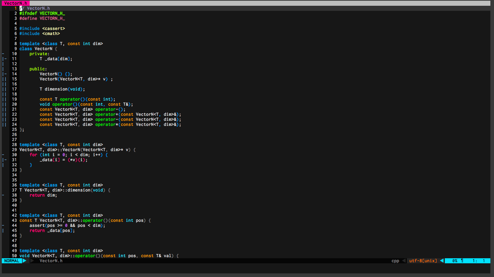

# mopkai.vim

This is Colorscheme for Vim based by molokai.  
But, this supports only color terminal yet.  

# Note
If you cannot get color like a below screenshot in gVim,  
You have to write 'colorscheme mopkai' after syntax
    " In your vimrc
    syntax enable
    colorscheme mopkai

# ScreenShot

